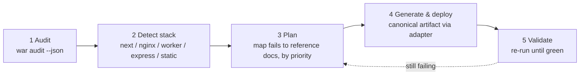

# webagent-skills

English | [简体中文](./README.zh-CN.md)

[](https://www.npmjs.com/package/webagent-skills)
[](./LICENSE)
[](https://nodejs.org)
[](https://agentskills.io)
[](#coverage-21-checks)
[](#why-its-stack-agnostic)
[](#development)
[](#2-cicd--readiness-regression-gate)

Audit and harden **any** website for **AI-agent readiness, SEO discoverability, and
security** — as an installable [Agent Skill](https://agentskills.io), a zero-dependency
CLI, and a programmatic API. One install works in **Claude Code, Cursor, Codex, and Qoder**.

It turns the "make my site agent-ready" checklist — robots.txt, sitemap, llms.txt,
Markdown-for-Agents, `.well-known` discovery, OAuth metadata, security headers, agent
cards, Web Bot Auth, commerce protocols, DNS-AID, WebMCP — into something an AI coding
agent can execute end-to-end on **any stack**.

## Why it exists

This tool grew out of a real deployment: while configuring Cloudflare's AI Crawl Control
and Transform Rules for a site, I realized the modern Web no longer serves humans alone —
it must also be **discoverable, consumable, and safely callable by AI agents**. Yet the
standards behind that *agent-readiness* (robots.txt, llms.txt, `.well-known` discovery,
OAuth metadata, Agent Cards, and more) are fragmented and often tied to a single platform.
So I distilled them into a **stack-agnostic** audit-and-hardening checklist, where
Cloudflare is just one delivery adapter among many — never a requirement.

## Why it's stack-agnostic

Every check separates two things:

- **The canonical artifact** — an RFC-defined file, header, or endpoint. Identical everywhere.
- **The delivery adapter** — how that artifact is served on your platform. Swappable.

The agent detects your stack, generates the canonical artifact, and wires it through the
matching adapter ([`references/adapters.md`](references/adapters.md)). Cloudflare is just
one adapter, never a requirement.

## Install

```bash
# Global CLI (provides `webagent-skills` and the short alias `war`)
npm install -g webagent-skills

# Or run without installing
npx webagent-skills@latest --help
```

Then install the **skill** into your coding agent(s):

```bash
war install                         # all agents, current repo (project scope)
war install --scope user            # global for this machine
war install --agents claude,cursor  # only specific agents
```

| Agent | Project scope | User scope |
|-------|---------------|------------|
| Claude Code | `.claude/skills/webagent-skills/` | `~/.claude/skills/…` |
| Cursor | `.cursor/skills/…` or `.agents/skills/…` | `~/.cursor/skills/…` |
| Codex | `.codex/skills/…` | `~/.codex/skills/…` |
| Qoder | `.qoder/skills/…` | — |

**Manual install**: copy `SKILL.md` + `references/` into `<agent-skills-dir>/webagent-skills/`.

## Use

### As a CLI

```bash
war audit https://example.com                 # score + grade + per-check report
war audit https://example.com --json          # machine-readable
war audit https://example.com --zh            # append Chinese notes (bilingual)
war audit https://example.com --category seo,security
war audit https://example.com --timeout 15 --user-agent "MyBot/1.0"
```

> **Command name**: `war` requires a global install (`npm install -g webagent-skills`) or an
> in-repo `npm link`. Without either, call `node bin/war.js audit …` or `npx webagent-skills audit …`.
>
> **Shell note**: the above is bash (Linux / macOS / Git Bash). In **Windows PowerShell** the comma is
> an array separator, so `--category seo,security` must be quoted: `--category "seo,security"`
> (otherwise the category filter silently matches nothing and returns an empty report).

Sample output:

```
  Agent-readiness audit — https://example.com
  ──────────────────────────────────────────────────────────
  Score  89/100   [████████████████████░░]   Grade B
  failing checks: 0

  ! WARN   ai           Markdown-for-Agents
        - artifact not served (HTTP 500)
  ✓ PASS   seo          robots.txt (RFC 9309)
  ✓ PASS   security     Security response headers
  ...
  ──────────────────────────────────────────────────────────
  Summary   6 pass  0 fail  2 warn  3 manual  13 skip
```

Color is on by default in an interactive terminal (status badges, score bar) and auto-downgrades
to plain text when piped / redirected / in CI. Force it with `--color` / `--no-color`, or set `NO_COLOR`.

> **Cross-platform**: Linux / macOS / Windows are all supported; requires Node ≥ 18.17 (global `fetch`).

Exit code is `0` when no check fails, else `1` — drop it into CI.

### As a library

```ts
import { auditSite } from "webagent-skills";

const report = await auditSite("https://example.com", { timeout: 12 });
// report: { target, score, grade, failed, counts, results[] }
```

`auditSite` is the same engine the CLI uses — import it to build a scoring API, a
dashboard, or a scheduled monitor.

### Through your coding agent

Once installed, the agent auto-loads the skill when you say things like:

> "Audit kunpuai.com for agent readiness and fix the failing checks."
> "Add robots.txt Content-Signal and an api-catalog to this Next.js app."
> "Harden the security headers and publish OAuth discovery metadata."

## The agent's workflow



1. **Audit** — run `war audit` against the live URL.
2. **Detect stack** — inspect the repo to choose the delivery adapter.
3. **Plan** — map each failing check to its reference doc, ordered by priority.
4. **Generate & deploy** — emit the canonical artifact via the adapter.
5. **Validate** — re-run the audit until green (optionally cross-check a third-party scanner).

## Real-world use cases

Five concrete ways teams ship `webagent-skills`, each mapping onto the audit → adapter → validate loop.

### 1. Next.js SaaS — AI discoverability + security in one pass

| | |
|---|---|
| **Environment** | Next.js (App Router) marketing/docs site on Vercel or self-hosted Node |
| **Pain point** | No `llms.txt`, `Content-Signal`, or AI-crawler rules, so LLMs can't consume content; incomplete security headers (CSP/HSTS/XFO) fail compliance scans |
| **Flow** | `war audit --json` → detect `next.config.*` + `app/` → generate `app/robots.ts` (GPTBot/ClaudeBot rules), `app/sitemap.ts`, `app/llms.txt/route.ts`, and inject headers via `next.config.js headers()` → re-audit until `failed: 0` |
| **Outcome** | Core checks flip `fail → pass`; score typically jumps **40–60 → 85+**; AI crawlers index correctly; security baseline met |

### 2. CI/CD — readiness regression gate

| | |
|---|---|
| **Environment** | Any pipeline (GitHub Actions / GitLab CI) with a preview URL |
| **Pain point** | A change silently drops `robots.txt` or a security header; nobody notices until production |
| **Flow** | Add `npx webagent-skills audit $PREVIEW_URL --json --category seo,security`; a non-zero exit (`failed > 0`) blocks the merge |
| **Outcome** | Agent-readiness + security become an **executable contract**; zero regression escape; zero-dep install runs anywhere |

### 3. nginx / static hosting — compliance retrofit

| | |
|---|---|
| **Environment** | nginx reverse-proxy legacy site, or S3 / GitHub Pages / Netlify static hosting |
| **Pain point** | No app framework to lean on; unclear how to serve discovery docs + headers at the server layer; the `add_header` inheritance trap silently drops headers |
| **Flow** | Audit → detect `nginx.conf` / static root → `location = /robots.txt { alias … }` + `add_header … always` (with the inheritance caveat), or drop literal `/.well-known/*` files + a Netlify `_headers` |
| **Outcome** | Framework-less sites reach the **same baseline**; avoids the common nginx header-inheritance incident |

### 4. Open API / agent backend — discovery & auth metadata

| | |
|---|---|
| **Environment** | REST/GraphQL API or agent-orchestratable backend (Express/Node, Next.js route, Worker) |
| **Pain point** | Agents can't auto-discover the API catalog or bootstrap OAuth, so automated integration is blocked |
| **Flow** | Audit validates `/.well-known/api-catalog` (RFC 9727), `oauth-authorization-server` (RFC 8414), `oauth-protected-resource` (RFC 9728), OIDC, `auth.md`, and `Link: rel="api-catalog"`; generate compliant JSON per `discovery-oauth.md`, publishing **public keys only** (`jwks_uri`), never weakening CORS/CSP |
| **Outcome** | The API becomes a **self-describing, securely-authenticatable** resource for agents; meets OAuth/OIDC discovery specs |

### 5. Agent ecosystem — A2A / MCP / Agent Skills / commerce

| | |
|---|---|
| **Environment** | Any stack wanting to join agent-to-agent networks, expose MCP tools, or accept agent payments |
| **Pain point** | No machine-readable agent identity/capabilities; hard to self-check commerce + frontier features |
| **Flow** | Audit `agent` / `commerce` / `experimental`: `agent-card.json`, `mcp/server-card.json`, `agent-skills/index.json`, `http-message-signatures-directory` (Web Bot Auth), `acp.json` / `ucp` / `x-payment-info`; `x402` / `AP2` / `WebMCP` are honestly reported as `manual` with guidance — never guessed, never side-effecting |
| **Outcome** | Machine-readable agent identity; `optional`/`manual` checks **don't penalize** the score (kept fair); frontier features get a safe manual-verification path |

## Coverage (21 checks)

| Category | Distribution | Checks |
|----------|:------------:|--------|
| SEO / AI-consumability | `██████` | robots.txt (RFC 9309), Content-Signal, AI crawler rules, sitemap.xml, llms.txt, Markdown-for-Agents |
| Security / Auth | `██████` | security headers (CSP/HSTS/XFO…), OAuth AS (RFC 8414), OIDC Discovery, OAuth PRM (RFC 9728), auth.md, Web Bot Auth (RFC 9421) |
| Commerce | `█████` | ACP, AP2, MPP, UCP, x402 |
| Agent discovery | `███` | A2A Agent Card, Agent Skills Discovery Index (v0.2.0), MCP Server Card |
| Discovery / APIs | `██` | Link headers (RFC 8288), API Catalog (RFC 9727) |
| Experimental | `██` | DNS-AID, WebMCP |

### Scoring model

Every check carries a severity that weights its contribution to the 0–100 site score.
`skip` and `manual` results are **excluded** from scoring, so unimplemented frontier
features never drag your grade down.

| Severity | Weight | | Status | Credit |
|----------|:------:|-|--------|:------:|
| `core` | **3** | | `pass` | 1.0 |
| `recommended` | **2** | | `warn` | 0.5 |
| `optional` | **1** | | `fail` | 0.0 |
| | | | `skip` / `manual` | _excluded_ |

```
grade  A ████████████████████  ≥ 90      D ████████              ≥ 40
       B ███████████████       ≥ 75      F ████                  < 40
       C ████████████          ≥ 60
```

Full assertion table (standard, path, content-type, required fields, priority):
[`references/checklist.md`](references/checklist.md).

## Project layout

```
webagent-skills/
├── package.json / tsconfig.json
├── LICENSE (Apache-2.0) / NOTICE
├── SKILL.md                     # the skill (lean orchestrator; details in references/)
├── AGENTS.md                    # universal pointer for agents reading the repo
├── bin/war.js                   # npm bin entry
├── src/                         # TypeScript source
│   ├── cli.ts                   # `audit` + `install` commands
│   ├── audit.ts                 # auditSite() engine + scoring (public API)
│   ├── checks.ts                # 21-check registry + evaluators + custom probes
│   ├── http.ts                  # zero-dep fetch layer (Node 18+)
│   ├── report.ts                # human-readable formatting
│   └── install.ts               # cross-agent skill installer
└── references/                  # 10 progressive-disclosure docs (shipped with the skill)
    ├── checklist.md · seo-discoverability.md · markdown-negotiation.md
    ├── security-headers.md · discovery-oauth.md · agent-cards.md
    └── web-bot-auth.md · commerce.md · experimental.md · adapters.md
```

## Development

```bash
npm install         # installs typescript + @types/node
npm run build       # tsc → dist/
npm run typecheck   # tsc --noEmit
node bin/war.js audit https://example.com
```

Requires Node ≥ 18.17 (global `fetch`, `AbortSignal.timeout`). Zero runtime dependencies.

## Safety guarantees

- **Passive audits only** — never `POST /agent/auth`, register accounts, or trigger payments.
- **No secrets in artifacts** — only public keys/URLs are published; private keys stay in your KMS.
- **Never weakens security** — discovery endpoints don't relax CSP/CORS or expose private paths.
- **Policy is the owner's call** — the agent asks before setting permissive `Content-Signal`/AI-crawl values.
- **TLS on by default** — `--insecure` is opt-in, warns loudly, staging-only.
- **SSRF note** — `auditSite` fetches whatever URL you pass. If you build a tool that scans
  arbitrary user-supplied URLs, add egress protection yourself (scheme/port allow-list, DNS
  resolve + reject private/loopback/link-local/reserved IPs incl. `169.254.169.254`, per-hop
  redirect re-validation, size caps) and rate limiting.

## Read-only auditor

`webagent-skills` is a read-only auditor: it fetches public URLs, reports what it
finds, and never modifies the sites it scans. The commerce category
(`references/commerce.md`) only *detects* whether a scanned site implements agent-payment
standards (ACP/AP2/MPP/UCP/x402); it is detection, not payment functionality.

## Standards & sources

RFC 9309 (robots), RFC 8288 (Link), RFC 9727 (api-catalog), RFC 8414 (OAuth AS),
RFC 9728 (OAuth PRM), RFC 9421 (HTTP Message Signatures), OIDC Discovery 1.0, Sitemaps
protocol, contentsignals.org, llmstxt.org, A2A Protocol, Agent Skills Discovery RFC v0.2.0,
MCP SEP-1649, IETF WebBotAuth, ACP/AP2/MPP/UCP/x402, DNS-AID, WebMCP. Check taxonomy
inspired by Cloudflare's agent-readiness guidance and isitagentready.com.

## Contributing

Issues and PRs welcome. Please keep checks declarative in `src/checks.ts`, add the
assertion to `references/checklist.md`, and run `npm run build` before submitting.

## License

[Apache-2.0](./LICENSE) © webagent-skills contributors. See [NOTICE](./NOTICE).
