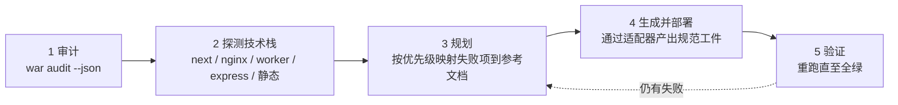

# webagent-skills

[English](./README.md) | 简体中文

[](https://www.npmjs.com/package/webagent-skills)
[](./LICENSE)
[](https://nodejs.org)
[](https://agentskills.io)
[](#覆盖范围21-项检查)
[](#为何与技术栈无关)
[](#开发)
[](#2-cicd就绪度回归门禁)

对**任意**网站进行 **AI-Agent 就绪度、SEO 可发现性与安全**审计与加固——同时提供可安装的
[Agent Skill](https://agentskills.io)、零依赖 CLI 与可编程 API。一次安装即可在
**Claude Code、Cursor、Codex、Qoder** 中通用。

它把"让站点适配 AI Agent"的清单——robots.txt、sitemap、llms.txt、Markdown-for-Agents、
`.well-known` 发现、OAuth 元数据、安全响应头、Agent Card、Web Bot Auth、商务协议、
DNS-AID、WebMCP——变成 AI 编码 Agent 能在**任意技术栈**上端到端执行的任务。

## 项目由来

本工具源于一次真实的上线部署：在为站点配置 Cloudflare 的 AI Crawl Control、Transform Rules
等能力时，我意识到现代 Web 已不再只服务人类用户——它同样需要被 AI Agent **发现、消费与安全调用**。
然而支撑这种「AI-Agent 就绪度」的标准（robots.txt、llms.txt、`.well-known` 发现、OAuth 元数据、
Agent Card 等）高度分散，且往往绑定于特定平台。于是我把它们抽象为一套**技术栈无关**的审计与
加固清单——Cloudflare 只是众多投递适配器之一，而非必需项。

## 为何与技术栈无关

每项检查都把两件事解耦：

- **规范工件**——由 RFC 定义的文件、响应头或端点，在任何平台都完全一致。
- **投递适配**——该工件在你的平台上如何被服务端下发，可自由替换。

Agent 会先探测你的技术栈，生成规范工件，再通过匹配的适配器落地
（见 [`references/adapters.md`](references/adapters.md)）。Cloudflare 只是其中一个适配器，绝非必需。

## 安装

```bash
# 全局 CLI（提供 `webagent-skills` 与短别名 `war`）
npm install -g webagent-skills

# 或免安装直接运行
npx webagent-skills@latest --help
```

然后把**技能**安装进你的编码 Agent：

```bash
war install                         # 所有 Agent，当前仓库（project 作用域）
war install --scope user            # 本机全局
war install --agents claude,cursor  # 仅指定 Agent
```

| Agent | 项目级 | 用户级 |
|-------|--------|--------|
| Claude Code | `.claude/skills/webagent-skills/` | `~/.claude/skills/…` |
| Cursor | `.cursor/skills/…` 或 `.agents/skills/…` | `~/.cursor/skills/…` |
| Codex | `.codex/skills/…` | `~/.codex/skills/…` |
| Qoder | `.qoder/skills/…` | — |

**手动安装**：把 `SKILL.md` + `references/` 复制到 `<agent-skills-dir>/webagent-skills/`。

## 使用

### 作为 CLI

```bash
war audit https://example.com                 # 评分 + 等级 + 逐项报告
war audit https://example.com --json          # 机器可读（CI 友好）
war audit https://example.com --zh            # 追加中文备注（英中双语）
war audit https://example.com --category seo,security
war audit https://example.com --timeout 15 --user-agent "MyBot/1.0"
```

> **命令名说明**：`war` 需先全局安装（`npm install -g webagent-skills`）或在仓库内执行 `npm link`；
> 若都没有，请直接用 `node bin/war.js audit …` 或 `npx webagent-skills audit …`。
>
> **Shell 差异**：以上为 bash（Linux / macOS / Git Bash）写法。在 **Windows PowerShell** 中逗号会被
> 当作数组分隔符，`--category seo,security` 必须加引号：`--category "seo,security"`（否则分类过滤会失效、返回空结果）。

输出示例：

```
  Agent-readiness audit — https://example.com
  ──────────────────────────────────────────────────────────
  Score  89/100   [████████████████████░░]   Grade B
  failing checks: 0

  ! WARN   ai           Markdown-for-Agents
        - artifact not served (HTTP 500)
  ✓ PASS   seo          robots.txt (RFC 9309)
  ✓ PASS   security     Security response headers
  ...
  ──────────────────────────────────────────────────────────
  Summary   6 pass  0 fail  2 warn  3 manual  13 skip
```

交互式终端中默认带颜色（状态徽章、分数进度条）；管道 / 重定向 / CI 中自动降级为纯文本。
可用 `--no-color` 强制关闭、`--color` 强制开启，或设置 `NO_COLOR` 环境变量。

> **跨平台**：Linux / macOS / Windows 均兼容，仅需 Node ≥ 18.17（用到全局 `fetch`）。

无检查失败时退出码为 `0`，否则为 `1`——可直接接入 CI。

### 作为库

```ts
import { auditSite } from "webagent-skills";

const report = await auditSite("https://example.com", { timeout: 12 });
// report: { target, score, grade, failed, counts, results[] }
```

`auditSite` 就是 CLI 使用的同一套引擎——把它 import 进去即可构建评分 API、仪表盘或定时监控。

### 通过你的编码 Agent

安装后，当你说下面这类话时，Agent 会自动加载该技能：

> "审计 kunpuai.com 的 agent 就绪度并修复失败项。"
> "给这个 Next.js 应用加上 robots.txt 的 Content-Signal 和 api-catalog。"
> "加固安全响应头并发布 OAuth 发现元数据。"

## Agent 的工作流



1. **审计**——对线上 URL 运行 `war audit`。
2. **探测技术栈**——检查仓库以选择投递适配器。
3. **规划**——把每个失败项映射到对应参考文档，按优先级排序。
4. **生成并部署**——通过适配器产出规范工件。
5. **验证**——反复重跑审计直到全绿（可选：与第三方扫描器交叉核对）。

## 实际应用场景

下面 5 个具体场景展示了团队如何落地 `webagent-skills`，每个都对应“审计 → 适配 → 验证”闭环。

### 1. Next.js SaaS——AI 可发现性 + 安全一站式整改

| | |
|---|---|
| **适用环境** | 部署在 Vercel 或自托管 Node 的 Next.js（App Router）官网/文档站 |
| **解决痛点** | 缺少 `llms.txt`、`Content-Signal` 与 AI 爬虫规则，LLM 无法有效消费内容；安全头不全（CSP/HSTS/XFO）导致合规扫描不过 |
| **执行流程** | `war audit --json` → 探测到 `next.config.*` + `app/` → 生成 `app/robots.ts`（GPTBot/ClaudeBot 规则）、`app/sitemap.ts`、`app/llms.txt/route.ts`，并在 `next.config.js headers()` 注入全套安全头 → 重跑审计直到 `failed: 0` |
| **预期收益** | 核心检查由 `fail → pass`；评分通常从 **40–60 跃升至 85+**；AI 爬虫正确索引；满足安全基线 |

### 2. CI/CD——就绪度回归门禁

| | |
|---|---|
| **适用环境** | 任意带预览 URL 的流水线（GitHub Actions / GitLab CI） |
| **解决痛点** | 某次改动悄悄删了 `robots.txt` 或安全头，直到上线都无人察觉 |
| **执行流程** | 加一步 `npx webagent-skills audit $PREVIEW_URL --json --category seo,security`；非零退出码（`failed > 0`）直接阻断合并 |
| **预期收益** | 将就绪度 + 安全变成**可执行的自动化契约**；回归零逃逸；零依赖即装即用 |

### 3. nginx / 静态托管——合规化改造

| | |
|---|---|
| **适用环境** | nginx 反代的老站，或 S3 / GitHub Pages / Netlify 纯静态托管 |
| **解决痛点** | 无应用框架可依托；不知道如何在服务器层下发发现文档与头部；`add_header` 继承陷阱会静默丢头 |
| **执行流程** | 审计 → 探测到 `nginx.conf` / 静态根 → `location = /robots.txt { alias … }` + `add_header … always`（并提示继承坑），或直接落 `/.well-known/*` 文件 + Netlify `_headers` |
| **预期收益** | 无框架站点同样达到**相同基线**；规避 nginx 头部继承这一高频事故 |

### 4. 开放 API / Agent 后端——发现与鉴权元数据

| | |
|---|---|
| **适用环境** | REST/GraphQL API 或可被 Agent 编排的后端（Express/Node、Next.js route、Worker） |
| **解决痛点** | Agent 无法自动发现 API 目录或自举 OAuth，导致自动化接入受阻 |
| **执行流程** | 审计校验 `/.well-known/api-catalog`（RFC 9727）、`oauth-authorization-server`（RFC 8414）、`oauth-protected-resource`（RFC 9728）、OIDC、`auth.md` 与 `Link: rel="api-catalog"`；按 `discovery-oauth.md` 生成合规 JSON，**仅发布公钥**（`jwks_uri`），绝不放宽 CORS/CSP |
| **预期收益** | API 成为面向 Agent 的**自描述、可安全鉴权**资源；满足 OAuth/OIDC 发现规范 |

### 5. Agent 生态——A2A / MCP / Agent Skills / 商务

| | |
|---|---|
| **适用环境** | 任意希望接入 Agent-to-Agent 网络、暴露 MCP 工具或接受 Agent 支付的技术栈 |
| **解决痛点** | 缺少机器可读的 Agent 身份/能力声明；商务与前沿特性难以自查 |
| **执行流程** | 审计 `agent` / `commerce` / `experimental`：`agent-card.json`、`mcp/server-card.json`、`agent-skills/index.json`、`http-message-signatures-directory`（Web Bot Auth）、`acp.json` / `ucp` / `x-payment-info`；`x402` / `AP2` / `WebMCP` 如实标注为 `manual` 并给出指引——绝不猜测、绝不产生副作用 |
| **预期收益** | 获得机器可读的 Agent 身份；`optional`/`manual` 检查**不拉低**评分（保持公允）；前沿特性有安全的人工核验路径 |

## 覆盖范围（21 项检查）

| 分类 | 分布 | 检查项 |
|------|:----:|--------|
| SEO / AI 可消费性 | `██████` | robots.txt (RFC 9309)、Content-Signal、AI 爬虫规则、sitemap.xml、llms.txt、Markdown-for-Agents |
| 安全 / 认证 | `██████` | 安全响应头 (CSP/HSTS/XFO…)、OAuth AS (RFC 8414)、OIDC Discovery、OAuth PRM (RFC 9728)、auth.md、Web Bot Auth (RFC 9421) |
| 商务 | `█████` | ACP、AP2、MPP、UCP、x402 |
| Agent 发现 | `███` | A2A Agent Card、Agent Skills Discovery Index (v0.2.0)、MCP Server Card |
| 发现 / API | `██` | Link 头 (RFC 8288)、API Catalog (RFC 9727) |
| 实验性 | `██` | DNS-AID、WebMCP |

### 评分模型

每项检查都有一个严重级别，决定其对 0–100 站点评分的加权贡献。`skip` 与 `manual`
结果会被**排除出计分**，因此未落地的前沿特性绝不会拉低你的等级。

| 严重级别 | 权重 | | 状态 | 得分 |
|----------|:----:|-|------|:----:|
| `core` | **3** | | `pass` | 1.0 |
| `recommended` | **2** | | `warn` | 0.5 |
| `optional` | **1** | | `fail` | 0.0 |
| | | | `skip` / `manual` | _排除_ |

```
等级  A ████████████████████  ≥ 90      D ████████              ≥ 40
      B ███████████████       ≥ 75      F ████                  < 40
      C ████████████          ≥ 60
```

完整断言表（标准、路径、content-type、必填字段、优先级）见
[`references/checklist.md`](references/checklist.md)。

## 项目结构

```
webagent-skills/
├── package.json / tsconfig.json
├── LICENSE (Apache-2.0) / NOTICE
├── SKILL.md                     # 技能（精简编排器；细节在 references/）
├── AGENTS.md                    # 供读取仓库的 Agent 使用的通用指针
├── bin/war.js                   # npm bin 入口
├── src/                         # TypeScript 源码
│   ├── cli.ts                   # `audit` + `install` 命令
│   ├── audit.ts                 # auditSite() 引擎 + 评分（对外 API）
│   ├── checks.ts                # 21 项检查注册表 + 评估器 + 自定义探针
│   ├── http.ts                  # 零依赖 fetch 层（Node 18+）
│   ├── report.ts                # 人类可读格式化
│   └── install.ts               # 跨 Agent 技能安装器
└── references/                  # 10 份渐进披露文档（随技能一起分发）
    ├── checklist.md · seo-discoverability.md · markdown-negotiation.md
    ├── security-headers.md · discovery-oauth.md · agent-cards.md
    └── web-bot-auth.md · commerce.md · experimental.md · adapters.md
```

## 开发

```bash
npm install         # 安装 typescript + @types/node
npm run build       # tsc → dist/
npm run typecheck   # tsc --noEmit
node bin/war.js audit https://example.com
```

需要 Node ≥ 18.17（全局 `fetch`、`AbortSignal.timeout`）。零运行时依赖。

## 安全保证

- **仅被动审计**——绝不 `POST /agent/auth`、注册账号或触发支付。
- **工件中不含密钥**——只发布公钥/URL；私钥留在你的 KMS。
- **绝不削弱安全**——发现类端点不会放开 CSP/CORS 或暴露私有路径。
- **策略由所有者决定**——在设置宽松的 `Content-Signal`/AI 爬取值前，Agent 会先询问。
- **默认开启 TLS 校验**——`--insecure` 为可选、会显著告警、仅限 staging。
- **SSRF 提示**——`auditSite` 会抓取你传入的任意 URL。若你要构建"任填 URL 即扫"的工具，
  请自行施加出站防护（协议/端口白名单、DNS 解析后拒绝私网/环回/链路本地/保留 IP，含
  `169.254.169.254`、逐跳重定向复验、大小上限）与限流。

## 只读审计器

`webagent-skills` 是一个只读审计器：它抓取公开 URL、报告发现的问题，且绝不修改被扫描
的站点。商务类检查（`references/commerce.md`）只是*探测*被扫站点是否实现了 agent 支付标准
（ACP/AP2/MPP/UCP/x402），属于检测能力，而非本工具的支付功能。

## 标准与来源

RFC 9309 (robots)、RFC 8288 (Link)、RFC 9727 (api-catalog)、RFC 8414 (OAuth AS)、
RFC 9728 (OAuth PRM)、RFC 9421 (HTTP Message Signatures)、OIDC Discovery 1.0、Sitemaps
protocol、contentsignals.org、llmstxt.org、A2A Protocol、Agent Skills Discovery RFC v0.2.0、
MCP SEP-1649、IETF WebBotAuth、ACP/AP2/MPP/UCP/x402、DNS-AID、WebMCP。检查分类受
Cloudflare 的 agent 就绪度指南与 isitagentready.com 启发。

## 贡献

欢迎提 Issue 与 PR。请把检查项以声明式方式加入 `src/checks.ts`，在
`references/checklist.md` 补上断言，并在提交前运行 `npm run build`。

## 许可证

[Apache-2.0](./LICENSE) © webagent-skills contributors。详见 [NOTICE](./NOTICE)。
